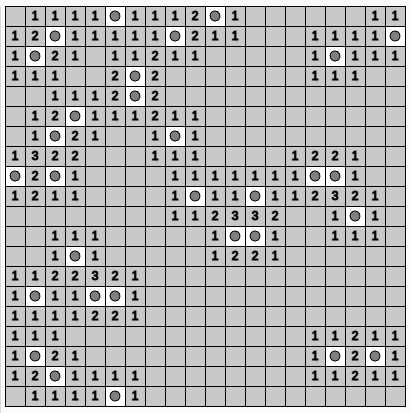

# Minesweeper

## Project



### Panduan Pengerjaan

Di dalam folder Memory Game, kalian akan menemukan dua file penting:
1. index.html
2. sketch.js

File index.html digunakan sebagai user interface, kalian bisa membukanya di browser kalian. Ada banyak cara, salah satunya adalah menggunakan extension Live Preview dari Microsoft di VSCode. Setelah melakukan instalasi, maka kalian bisa klik kanan lalu memilih "Show Preview" yang akan membuka file index.html di browser.

File sketch.js digunakan untuk coding, jadi kalian perlu mengetikkan kode yang diperlukan di sini agar game bisa berjalan dengan baik.

### Description

Pada _project_ kali ini kalian diberikan beberapa _function_ dengan penamaan sesuai kegunaannya, yaitu:

1. `setup` : Function ini adalah entry point dari program ini. Fungsi ini **membuat _canvas_ dan memanggil function lainnya** untuk membuat papan permainan dan menempatkan 'bees' secara acak di dalam papan. Selain itu, fungsi ini juga menghitung jumlah 'bees' di sekitar setiap _tile_.
2. `createBoard` : Function ini **membuat papan permainan** dengan memanggil function `createTile` untuk setiap _tile_ pada papan.
3. `createTile` : Function ini **membuat _tile_** dengan posisi dan ukuran yang ditentukan.
4. `placeBees` : Function ini **menempatkan 'bees' secara acak** di dalam papan permainan.
5. `countBees` : Function ini **menghitung jumlah 'bees' di sekitar setiap _tile_**.
6. `draw` : Function ini **menggambar papan permainan** dengan memanggil function `drawTile` untuk setiap _tile_.
7. `reveal` : Function ini **membuka _tile_** dan jika _tile_ tersebut tidak memiliki 'bee' di sekitarnya, function ini juga akan memanggil function `floodFill`.
8. `floodFill` : Function ini **membuka _tile_ di sekitar _tile_ yang sedang diproses** jika _tile_ tersebut tidak memiliki 'bee' di sekitarnya.
9. `mousePressed` : Function ini **dipanggil ketika mouse diklik**, bertugas untuk memeriksa dan membuka _tile_ serta memeriksa apakah _tile_ tersebut memiliki 'bee'.
10. `isUnderMouse` : Function ini **mengecek apakah _tile_ berada di bawah kursor mouse** atau tidak.
11. `gameOver` : Function ini **membuka semua _tile_** saat permainan berakhir.

Selain itu, terdapat beberapa variabel global seperti `board`, `cols`, `rows`, `w`, dan `totalBees` yang digunakan untuk menyimpan data permainan.

Berikut adalah penjelasan untuk setiap variabel:

1. `board`: Ini adalah array dua dimensi yang akan berisi objek-objek _tile_ yang mewakili papan permainan.

    ```js
    let board;
    ```

2. `cols` dan `rows`: Ini adalah variabel yang menentukan jumlah kolom dan baris di papan permainan. Dalam hal ini, papan permainan akan memiliki sepuluh kolom dan sepuluh baris.

    ```js
    let cols = 10;
    let rows = 10;
    ```

3. `w`: Ini adalah variabel yang menentukan ukuran setiap _tile_.

    ```js
    let w = 40;
    ```

4. `totalBees`: Ini adalah variabel yang menentukan jumlah total 'bees' yang akan ditempatkan di dalam papan permainan.

    ```js
    let totalBees = 10;
    ```

#### `setup`

Function `setup` akan digunakan sebagai entry point dari program ini. Function ini tidak menerima parameter apapun.

Berikut ini adalah beberapa hal yang perlu kamu lakukan dalam mengimplementasikan function `setup`:

1. Membuat papan permainan dengan memanggil function `createBoard` dan hasilnya disimpan dalam variabel global `board`.
2. Menempatkan 'bees' secara acak di dalam papan permainan dengan memanggil function `placeBees`.
3. Menghitung jumlah 'bees' di sekitar setiap _tile_ dengan memanggil function `countBees`.

#### `createBoard`

Function `createBoard` akan digunakan untuk membuat papan permainan dalam bentuk array dua dimensi. Function ini menerima dua parameter, yaitu jumlah kolom (`cols`) dan jumlah baris (`rows`).

Berikut ini adalah beberapa hal yang perlu kamu lakukan dalam mengimplementasikan function `createBoard`:

1. Membuat dan mengembalikan array dua dimensi dengan ukuran `cols` x `rows`.
2. Memanggil function `createTile` untuk setiap _tile_ di dalam papan permainan.

Untuk membantu kamu memahami lebih baik apa yang perlu dilakukan, berikut ini adalah hal yang dapat kamu gunakan sebagai acuan:

-   `createBoard` harus menghasilkan array dua dimensi dengan ukuran yang sesuai.
-   `createBoard` harus memanggil function `createTile` untuk setiap _tile_ di dalam papan permainan.
-   `createBoard` harus menghasilkan array dua dimensi yang berisi objek-objek _tile_.

#### `createTile`

Function `createTile` digunakan untuk membuat objek _tile_ yang akan digunakan dalam papan permainan. Function ini menerima tiga parameter, yaitu:

-   `i` (indeks kolom dari _tile_)
-   `j` (indeks baris dari _tile_)
-   `w` (ukuran dari _tile_).

Berikut ini adalah beberapa hal yang perlu kamu lakukan dalam mengimplementasikan function `createTile`:

1. Function ini harus mengembalikan objek `tile` dengan properti `i`, `j`, `x`, `y`, `w`, `neighborCount`, `bee`, dan `revealed`.
2. Nilai properti `i` dan `j` ditentukan oleh parameter yang diterima function.
3. Nilai properti `x` dan `y` dihitung dengan mengalikan `i` dan `j` dengan `w`.
4. Nilai properti `w` ditentukan oleh parameter yang diterima function.
5. Nilai properti `neighborCount` diawal bernilai `0`.
6. Nilai properti `bee` dan `revealed` diawal bernilai `false`.

Untuk membantu kamu memahami lebih baik apa yang perlu dilakukan, berikut ini adalah hal yang dapat kamu gunakan sebagai acuan:

-   `createTile` harus menghasilkan objek dengan properti yang benar.
-   `createTile` harus menghasilkan objek dengan nilai `x` dan `y` yang dihitung dengan benar.
-   `createTile` harus menghasilkan objek dengan `neighborCount`, `bee`, dan `revealed` awalnya bernilai `0` dan `false`.

#### `placeBees`

Function `placeBees` akan digunakan untuk menempatkan 'bees' secara acak di dalam papan permainan. Function ini menerima empat parameter, yaitu:

-   `board` (papan permainan)
-   `totalBees` (jumlah total 'bees' yang akan ditempatkan)
-   `cols` (jumlah kolom pada papan)
-   `rows` (jumlah baris pada papan).

Berikut ini adalah beberapa hal yang perlu kamu lakukan dalam mengimplementasikan function `placeBees`:

1. Menempatkan 'bees' secara acak di dalam papan permainan sampai jumlah 'bees' yang ditempatkan sama dengan `totalBees`.
2. Memastikan bahwa setiap _tile_ hanya dapat memiliki satu 'bee'.

#### `countBees`

Function `countBees` digunakan untuk menghitung jumlah 'bees' di sekitar sebuah _tile_. Function ini menerima dua parameter, yaitu `board` (papan permainan) dan `tile` (_tile_ yang ingin dihitung jumlah 'bees' di sekitarnya).

Berikut ini adalah beberapa hal yang perlu kamu lakukan dalam mengimplementasikan function `countBees`:

1. Menghitung jumlah 'bees' di sekitar _tile_ (di atas, di bawah, di kiri, di kanan, dan di setiap sudutnya secara diagonal).
2. Jika _tile_ tersebut adalah 'bee', maka `neighborCount` harus diatur menjadi `-1`.
3. Jika _tile_ tersebut bukan 'bee', maka `neighborCount` harus diatur menjadi jumlah 'bees' di sekitar _tile_ tersebut.

#### `draw`

Function `draw` digunakan untuk menggambar papan permainan. Function ini tidak menerima parameter apapun.

Yang perlu kamu lakukan dalam mengimplementasikan function `draw` yaitu menggambar setiap _tile_ pada papan permainan dengan memanggil function `drawTile` sejumlah `col` dan `rows`.

#### `drawTile`

Function `drawTile` digunakan untuk menggambar _tile_ pada papan permainan. Function ini menerima satu parameter, yaitu objek `tile` yang akan digambar.

Berikut ini adalah beberapa hal yang perlu kamu lakukan dalam mengimplementasikan function `drawTile`:

1. Menggambar batas _tile_ dengan function `rect` dan `stroke`.
2. Melakukan pengecekan kondisi terhadap properti `revealed` dari `tile`. Jika `revealed` bernilai `true`, maka:
    - Jika `bee` bernilai `true`, memanggil function `drawBeeTile`.
    - Jika `bee` bernilai `false`, memanggil function `drawNumberTile`.

#### `drawBeeTile`

Function `drawBeeTile` digunakan untuk menggambar _tile_ yang berisi 'bee'. Function ini menerima satu parameter, yaitu objek `tile` yang akan digambar.

Yang perlu kamu lakukan dalam mengimplementasikan function `drawBeeTile` yaitu menggambar 'bee' dalam bentuk elips pada posisi tengah _tile_ menggunakan function `ellipse` dan `fill`.

#### `drawNumberTile`

Function `drawNumberTile` digunakan untuk menggambar _tile_ yang berisi angka jumlah 'bees' di sekitarnya. Function ini menerima satu parameter, yaitu objek `tile` yang akan digambar.

Berikut ini adalah beberapa hal yang perlu kamu lakukan dalam mengimplementasikan function `drawNumberTile`:

1. Menggambar _tile_ menggunakan function `rect` dan `fill`.
2. Jika properti `neighborCount` dari `tile` lebih dari 0, menggambar angka tersebut pada posisi tengah _tile_ menggunakan function `text`, `textAlign`, dan `fill`.

#### `reveal`

Function `reveal` digunakan untuk membuka _tile_ pada papan permainan. Function ini menerima satu parameter, yaitu objek `tile` yang akan dibuka.

Berikut ini adalah beberapa hal yang perlu kamu lakukan dalam mengimplementasikan function `reveal`:

1. Mengubah properti `revealed` dari `tile` menjadi `true`.
2. Melakukan pengecekan kondisi terhadap properti `neighborCount` dari `tile`. Jika `neighborCount` bernilai `0`, maka memanggil function `floodFill`.

#### `floodFill`

Function `floodFill` digunakan untuk membuka _tile_ di sekitar _tile_ yang sedang diproses jika _tile_ tersebut tidak memiliki 'bee' di sekitarnya. Function ini menerima satu parameter, yaitu objek `tile` yang sedang diproses.

Berikut ini adalah beberapa hal yang perlu kamu lakukan dalam mengimplementasikan function `floodFill`:

1. Melakukan iterasi terhadap _tile_ di sekitar `tile` yang sedang diproses (di atas, di bawah, di kiri, di kanan, dan di setiap sudutnya secara diagonal)..
2. Memeriksa apakah _tile_ yang sedang diperiksa berada dalam batas papan permainan dan belum dibuka.
3. Jika memenuhi kondisi di atas, memanggil function `reveal` untuk _tile_ tersebut.

#### `mousePressed`

Function `mousePressed` akan dipanggil saat mouse diklik. Function ini tidak menerima parameter apapun.

Berikut ini adalah beberapa hal yang perlu kamu lakukan dalam mengimplementasikan function `mousePressed`:

1. Melakukan iterasi terhadap setiap _tile_ di dalam `board`.
2. Memeriksa apakah _tile_ berada di bawah kursor mouse dengan memanggil function `isUnderMouse`.
3. Jika _tile_ berada di bawah kursor mouse, memanggil function `reveal` untuk _tile_ tersebut.
4. Jika _tile_ yang dibuka adalah 'bee', memanggil function `gameOver`.

#### `isUnderMouse`

Function `isUnderMouse` digunakan untuk mengecek apakah sebuah _tile_ berada di bawah kursor mouse. Function ini menerima tiga parameter, yaitu:

-   `tile` (objek _tile_ yang sedang diperiksa)
-   `x` (koordinat x dari posisi mouse)
-   `y` (koordinat y dari posisi mouse).

Berikut ini adalah beberapa hal yang perlu kamu lakukan dalam mengimplementasikan function `isUnderMouse`:

1. Memeriksa apakah koordinat mouse berada di dalam area _tile_.
2. Mengembalikan `true` jika koordinat mouse berada di dalam area _tile_, dan `false` jika tidak.

#### `gameOver`

Function `gameOver` digunakan untuk membuka semua _tile_ pada papan permainan saat permainan berakhir. Function ini menerima satu parameter, yaitu `board` yang merupakan array dua dimensi yang merepresentasikan papan permainan.

Berikut ini adalah beberapa hal yang perlu kamu lakukan dalam mengimplementasikan function `gameOver`:

1. Melakukan iterasi terhadap setiap _tile_ di dalam `board`.
2. Mengubah properti `revealed` dari setiap _tile_ menjadi `true`.
